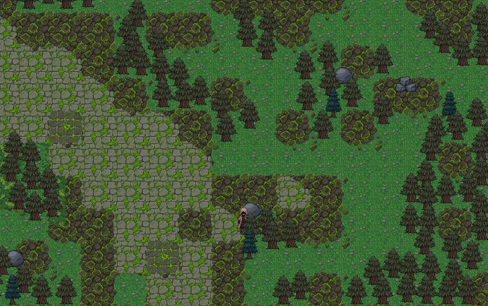
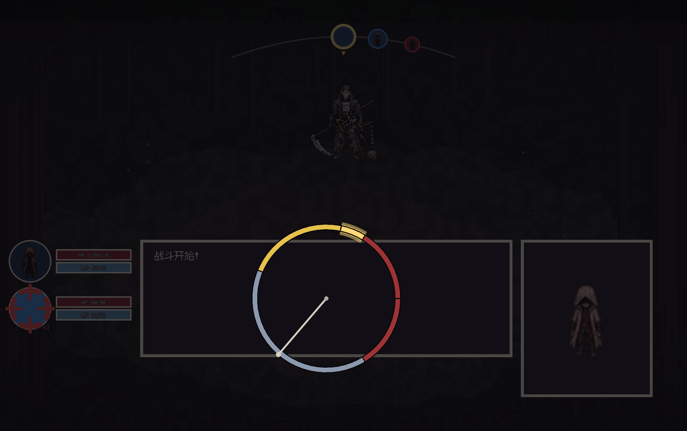
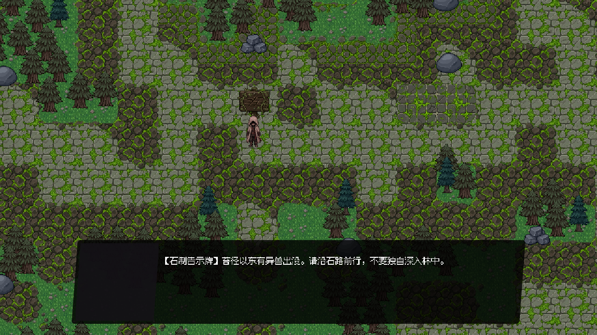

# 星辰之烬纪元

一部正在制作的俯视角像素 RPG：在林间辨认危险，在回合间选择行动，在攻击落下的一刻作出反应。



*本地开发截图。地图、角色与界面仍在迭代；图片展示单个场景的实现状态。*

本项目由 [郑皓云](https://github.com/HaoyunZheng) 独立主导产品设计与 AI 辅助开发，使用 **Godot 4.6 / GDScript**。目前是**开发中的系统原型，尚未形成完整可玩版本**，适合查看设计、代码与阶段性画面。完整体验、内容衔接和数值平衡仍在制作。

[玩法与系统](#正在构建的体验) · [运行工程](#运行工程) · [开发笔记](docs/showcase/development.md) · [世界设定](game/world-bible/canon-status.md)

## 正在构建的体验

### 看得见的危险，主动选择的遭遇

探索采用俯视角移动。敌人在地图上巡逻，接触后进入独立战斗场景；玩家可以接近、绕行，或先返回整备。森林、空地与遗迹是当前的开发场景，承担移动、交互和场景切换的验证。

### 回合决定策略，时机决定执行

在攻击、技能、物品和撤退之间安排回合，再通过动作化交互执行选择。攻击转盘要求玩家按键定格；防御与闪避姿态则对应敌方攻击中的时机判断。目标提示、攻击预警、判定和反馈需要彼此一致，这是当前战斗系统持续调整的重点。



*攻击转盘的视觉测试截图：由捕获脚本直接构造测试状态，并非连续游玩录像。角色头像与部分 UI 仍含占位内容。*

### 用痕迹和对话交代世界

Dialogic 驱动逐字文本、选项与调查交互。路牌、旅人和环境痕迹是目前的叙事入口；长期世界设定另有档案，区分已确认规则、提案与待解决问题。



*路牌调查的本地开发截图。场景文字是交互样例；主角身份、首个正式区域与完整剧情仍在设计。*

### 在篝火整理下一次出发

背包、物品操作、篝火恢复、存档/读取与篝火间传送已有代码实现。成长原型使用封顶等级和现有技能强化，服务于“战斗—回火—整备”的循环验证。

## 当前进度

| 已有系统实现 | 仍需打磨或扩展 |
|---|---|
| 森林移动、敌人巡逻、场景切换 | 地图边界、内容密度与完整探索路线 |
| 回合流程、攻击转盘、敌方时机判定 | 数值平衡、反馈清晰度、完整战斗体验 |
| 背包、篝火、存档和传送 | 跨系统衔接、异常流程与整体回归 |
| Dialogic 对话、路牌调查 | 角色、任务、剧情与世界设定的游戏化 |

当前优先级是把已有系统衔接为清晰、稳定、可重复体验的短流程。羁绊与诅咒等扩展机制保留在设计阶段，待基础循环验证后再推进。这里的“已有实现”指仓库中存在对应系统，不等于整部游戏已经完成验收。

## 运行工程

工程配置声明 **Godot 4.6、Forward Plus 渲染器**，主场景为 `game/scenes/Main.tscn`。插件已随仓库收录。首次打开需等待资源导入和脚本类扫描完成。

```bash
git clone https://github.com/HaoyunZheng/pixel_rpg_game_of_mine.git
cd pixel_rpg_game_of_mine
godot --editor --path game
```

在编辑器中按 **F6** 运行当前场景，或按 **F5** 运行主场景。若 `godot` 不在 PATH 中，可在 Godot 项目管理器导入 `game/project.godot`；macOS 应用默认位置可用 `/Applications/Godot.app/Contents/MacOS/Godot` 替代命令中的 `godot`。

以上是源码工程入口，当前未提供经过发行验收的可下载试玩包。若遇到问题，请附上引擎版本、运行场景、重现步骤与错误日志。

### 键盘操作

| 按键 | 当前主要用途 |
|---|---|
| `W A S D` / 方向键 | 移动、菜单方向选择 |
| `Z` | 交互、确认、攻击转盘定格；防御姿态中的时机输入 |
| `X` | 背包；相关界面的返回/取消 |
| `Shift` | 跑步；闪避姿态中的冲刺输入 |
| `F11` | 切换全屏 |

输入会随场景与当前姿态变化，具体映射见 [project.godot](game/project.godot) 与对应系统脚本。

## 从哪里读代码

| 想了解什么 | 入口 |
|---|---|
| 探索、遇敌与场景流转 | [ForestMain.gd](game/scripts/ForestMain.gd)、[EnemyPatrol.gd](game/scripts/characters/EnemyPatrol.gd)、[SceneManager.gd](game/scripts/autoload/SceneManager.gd) |
| 回合流程与战斗交互 | [Battle.gd](game/scripts/Battle.gd)、[AttackPowerWheel.gd](game/scripts/battle/AttackPowerWheel.gd)、[DefenseTimingCheck.gd](game/scripts/battle/DefenseTimingCheck.gd) |
| 背包、篝火和存档 | [InventoryUI.gd](game/scripts/ui/InventoryUI.gd)、[CampfireUI.gd](game/scripts/ui/CampfireUI.gd)、[GameData.gd](game/scripts/autoload/GameData.gd) |
| 对话与调查 | [DialogueManager.gd](game/scripts/autoload/DialogueManager.gd)、[SignpostNPC.gd](game/scripts/characters/SignpostNPC.gd) |
| 素材生产链 | [sprite-pipeline](sprite-pipeline/README.md)：图像生成/输入、处理、打包、Godot 导入 |
| 专项检查与截图 | [game/test](game/test)：场景检查、存档/传送检查、战斗视觉捕获脚本 |

## 设计与制作记录

[开发笔记](docs/showcase/development.md) 解释当前范围、战斗交互和世界观组织的取舍。[世界规则基线](game/world-bible/rules/_index.md) 与 [正典状态表](game/world-bible/canon-status.md) 说明设定的确认状态。早期[通用设计文档](game/docs/superpowers/specs/星辰之烬纪元_通用文档.md)仍包含长期目标和历史设定，应结合文档日期与后续范围决定阅读。

## 制作与致谢

郑皓云负责玩法与交互规格、世界观推演、范围取舍、工具分工和实现审阅，并参与脚本与配置的修改和问题定位。AI 工具参与设计讨论、图像/像素素材、编码和音乐制作；具体分工见开发笔记。

工程使用 Godot，以及 Dialogic、Phantom Camera、Godot Resource Groups 等插件；字体包括 Fusion Pixel。各第三方组件的原署名及许可仍保留在其目录中。游戏本体和素材目前未统一声明再分发许可，复用前请核对具体来源与授权范围。

[个人作品集](https://glistening-phoenix-8eeca1.netlify.app) · [GitHub](https://github.com/HaoyunZheng)
